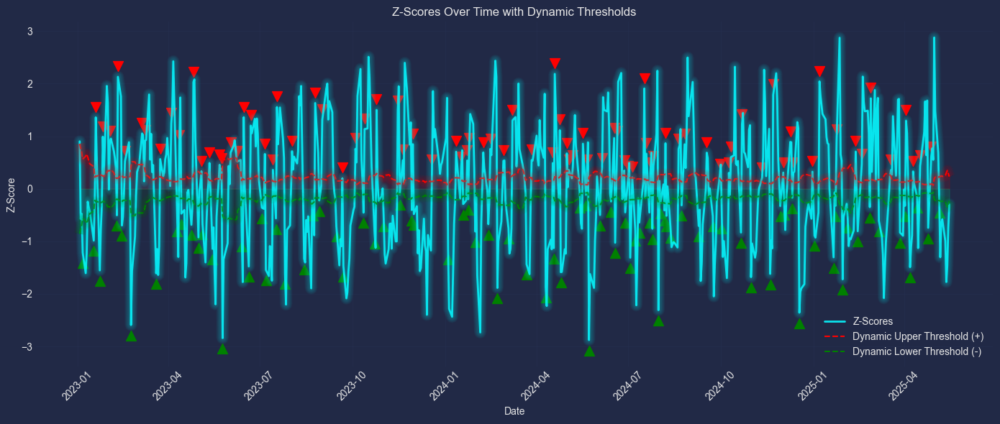
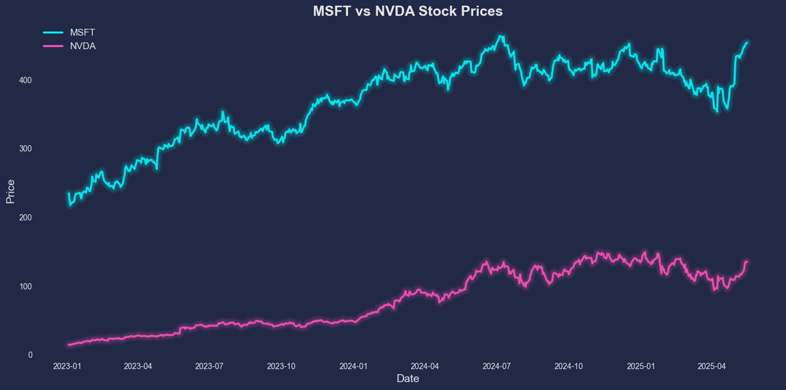
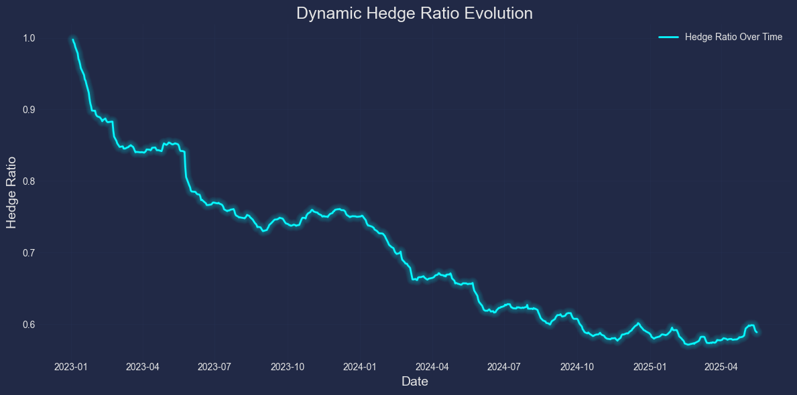
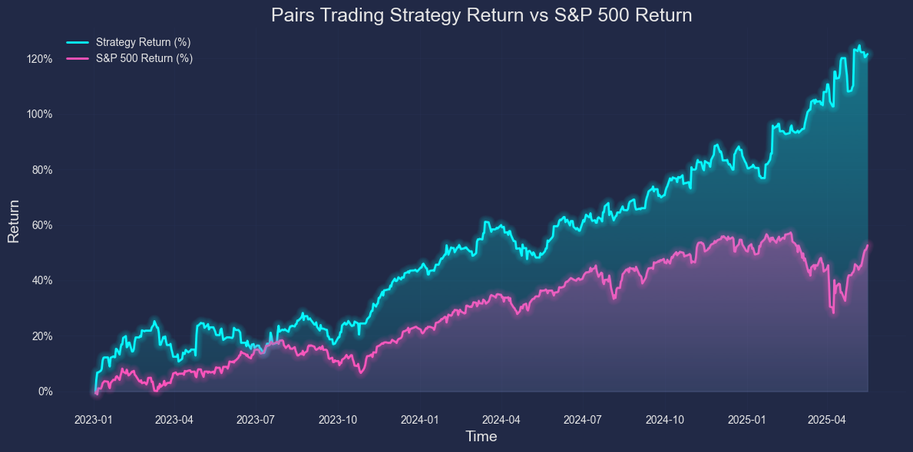
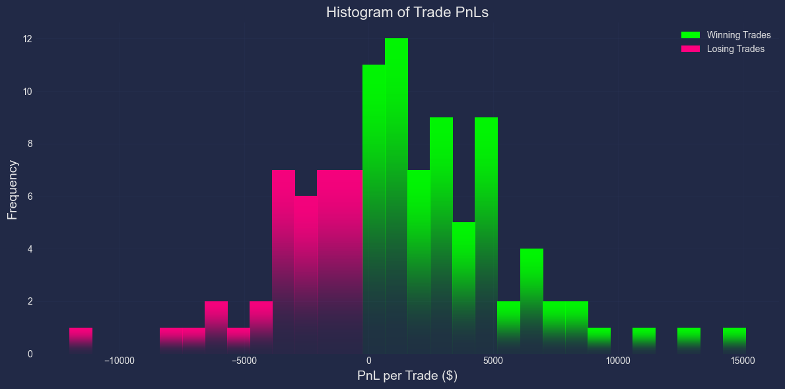

# 📈 Statistical Arbitrage via Dynamic Pairs Trading with Kalman Filtering and Z-Score Thresholds

This project implements a **statistical arbitrage strategy** using **dynamic hedge ratio estimation** with a Kalman Filter, **z-score-based trade signals**, and **backtesting with performance metrics** (including Sharpe ratio, win rate, PnL curves, etc.). Built entirely in Python. This strategy aims to mirror a statistical arbitrage system used in quantitative trading.

> 🚀 Designed to model real-world pairs trading behavior with dynamic entry/exit signals, rolling spread statistics, and risk management built-in.

---

## 📗 Strategy Overview

- Cointegration tested using **Engle-Granger ADF test** and **KPSS test**  
- Hedge ratio calculated and dynamically updated with a **Kalman Filter**
- Rolling volatility calculations for **adaptive thresholds**
- Z-scores calculated based on rolling mean and standard deviation 
- Entry when the spread's z-score > threshold
- Multi-condition exits:
   - Mean reversion (|z-score| < exit threshold)
   - Take Profit (%-based)
   - Stop Loss (%-based)
   - Max Trade Duration (N days) 
- Performance Metrics
  - Realized Profit
  - Trade Win Rate
  - Sharpe Ratio
- Graphs
  - Z-Scores over time
  - Stock prices over time
  - Hedge ratio evolution
  - Portfolio value over time compared to S&P 500
  - Trade PnL distribution

---
> This project was built to explore how quantitative trading strategies like pairs trading can be implemented and dynamically adapted using mathematical and statistical techniques (e.g., the Kalman Filter). The goal was to move beyond textbook implementations and emulate real-world production trading logic, incorporating adaptive thresholds, statistics-based volatility, and risk management mechanisms such as stop loss and take profit.
---

**Code Overview**

**`backtesting/`**
- `backtester.ipynb`: Backtesting engine that runs the full strategy. Does the dynamic Kalman filter updates, z-score logic, position management, and trade execution.

- `backtest_helpers.py`: Contains helper functions like Sharpe ratio calculation and the core Kalman filter logic (initial_kalman_hedge, kalman_update).

**`analysis_scripts/`**
- `cointegration_tests.py`: Runs statistical tests (Engle-Granger ADF and KPSS) to check if two stocks are cointegrated.

**`data/`**
- `get_data.py`: Pulls historical stock prices using Yahoo Finance and provides multiple price normalization methods.

- `visualize_data.py`: Function that plots stocks over a certain time period and a function that interpolates stock prices with polynomial regression 
---

## 📊 Backtest Demo and Results

```python
tickers = ['MSFT', 'NVDA']
train_dates = ['2020-01-01', '2022-12-31']
test_dates = ['2023-01-01', '2025-05-19']
threshold = 4
exit_threshold = 0.05
capital = 100000
max_trade_duration = 5
stop_loss_percent = 0.03
take_profit_percent = 0.06

backtest(tickers, train_dates, test_dates, threshold, exit_threshold, capital, max_trade_duration, \
         stop_loss_percent, take_profit_percent, interval="1d")

```


```

Engle-Granger Test - ✅ Good for Cointegration

KPSS Test - ✅ Good for Cointegration

2023-01-03: Entered inward position - shorted MSFT with 401 shares and longed NVDA with 400 shares
2023-01-05: Exited trade due to: Take profit hit
PnL from trade: $6767.36

2023-01-06: Entered outward position - longed MSFT with 454 shares and shorted NVDA with 448 shares
2023-01-13: Exited trade due to: Max trade duration reached
PnL from trade: $5449.74

2023-01-17: Entered outward position - longed MSFT with 444 shares and shorted NVDA with 420 shares
2023-01-24: Exited trade due to: Max trade duration reached
PnL from trade: $79.47

2023-01-25: Entered outward position - longed MSFT with 443 shares and shorted NVDA with 402 shares
2023-02-01: Exited trade due to: Z-score mean reversion
PnL from trade: $4620.21

2023-02-02: Entered inward position - shorted MSFT with 419 shares and longed NVDA with 373 shares
2023-02-09: Exited trade due to: Max trade duration reached
PnL from trade: $636.51

2023-02-10: Entered inward position - shorted MSFT with 424 shares and longed NVDA with 375 shares
2023-02-17: Exited trade due to: Max trade duration reached
PnL from trade: $1871.88

2023-02-21: Entered inward position - shorted MSFT with 448 shares and longed NVDA with 395 shares
2023-02-28: Exited trade due to: Max trade duration reached
PnL from trade: $2441.35

2023-03-06: Entered inward position - shorted MSFT with 447 shares and longed NVDA with 379 shares
2023-03-13: Exited trade due to: Max trade duration reached
PnL from trade: $1074.44

2023-03-14: Entered inward position - shorted MSFT with 444 shares and longed NVDA with 376 shares
2023-03-16: Exited trade due to: Stop loss hit
PnL from trade: $-6167.22

. . . 

2025-05-12: Entered outward position - longed MSFT with 425 shares and shorted NVDA with 254 shares

Total trades: 102

Total Realized PnL: $122304.36

Percent Returns (Realized): 122.3%

Win Rate: 64%

Sharpe Ratio: 1.84

```






---

## 🧪 How to Run

1. Clone the repo  
2. Install required libraries (`pip install -r requirements.txt`)  
3. Set the parameters in `backtest()` call  
4. Run the script to backtest and generate plots

```python
tickers = ['MSFT', 'NVDA']
train_dates = ['2020-01-01', '2022-12-31']
test_dates = ['2023-01-01', '2025-05-19']
threshold = 4
exit_threshold = 0.05
capital = 100000
max_trade_duration = 5
stop_loss_percent = 0.03
take_profit_percent = 0.06

backtest(tickers, train_dates, test_dates, threshold, exit_threshold, capital, max_trade_duration, \
         stop_loss_percent, take_profit_percent, interval="1d")
```

## 🚧 Future Work (v2.0 Roadmap)

Version 2.0 will implement Machine Learning powered automated hyperparameter optimization using training data to tune key values like z-score thresholds, max trade duration, and risk levels. Additional planned upgrades include:

- Walk-forward cross-validation for robustness
- Regime detection using volatility or macro indicators
- Integration of Bayesian regression or particle filters as alternative estimators
- Order execution simulation with slippage and spread modeling
